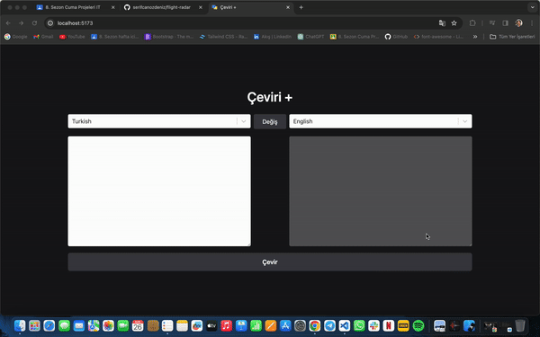

# translate

🌐 Çok Dilli Çeviri Uygulaması: React ve Redux-Thunk ile Güçlendirilmiş!

Merhaba LinkedIn ailem! Size heyecan verici bir projeyle geldim: Çok Dilli Çeviri Uygulaması! Bu uygulama, React ve Redux-Thunk kullanılarak geliştirildi ve kullanıcıların 100'den fazla dil arasında çeviri yapmalarını sağlıyor.

🚀 Teknolojiler ve Özellikler:

React: Güçlü bir kullanıcı arayüzü oluşturmak için tercih ettiğimiz açık kaynaklı bir JavaScript kütüphanesi.
Redux-Thunk: Asenkron işlemleri yönetmek ve uygulama durumunu yönetmek için kullanılan bir Redux orta yazılımı.
Axios: HTTP isteklerini yapmak için kullanılan basit ve güçlü bir kütüphane. Bu, API isteklerimizi yönetmek için tercih ettiğimiz araç.
100+ Dil Desteği: Kullanıcılar, çevirmek istedikleri metni 100'den fazla dil seçeneği arasında seçebilirler.
🎨 Kullanıcı Dostu Arayüz:

Basit, sezgisel ve etkili bir kullanıcı arayüzü tasarımıyla, herkesin kolayca kullanabileceği bir deneyim sunuyoruz.
Kullanıcılar, metin girişi yapabilir ve hızlıca istedikleri dili seçerek çevirilerini alabilirler.
🌍 Neden Bu Proje?

Dünya genelindeki kullanıcıların, farklı dillerdeki içeriklere erişme ve iletişim kurma ihtiyacını karşılamak için geliştirildi.
Hem kişisel hem de iş amaçlı kullanımlar için mükemmel bir araç olarak tasarlandı.
Bu uygulama, çoklu dil desteği sağlayarak küresel kullanıcılar için değerli bir çözüm sunuyor. Her türlü geri bildirimi dört gözle bekliyoruz ve paylaşarak bu projenin daha geniş bir kitleye ulaşmasına yardımcı olabilirsiniz. Teşekkürler!

# ScreenShot

